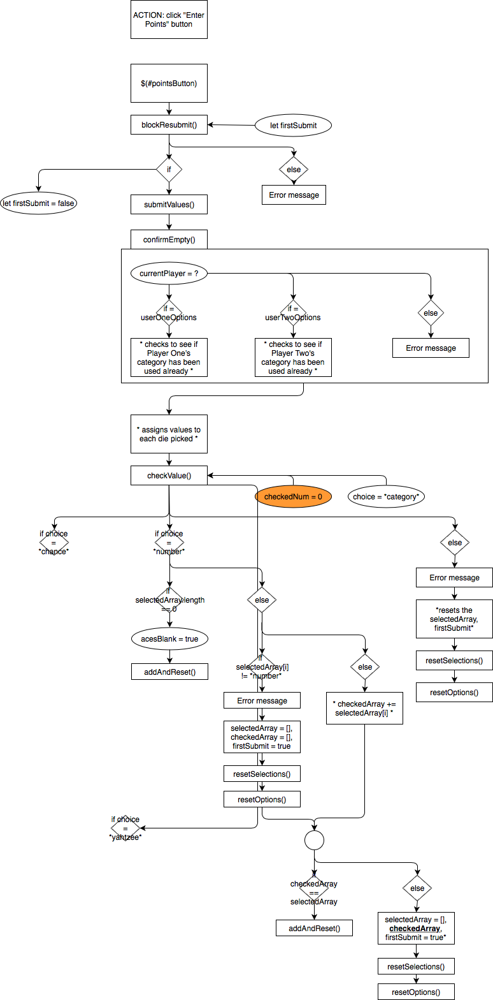

# Quick Yahtzee
### https://quick-yahtzee.herokuapp.com

**Purpose:** This code is essentially a shortened version of "Yahtzee", a traditional game of chance that involves dice. It is designed for two users to play the game on a single browser.

**Languages:** HTML, CSS (with SASS), Javascript (with jQuery)

**Mobile-friendly?:** Yes

"Quick Yahtzee" is the first, independent work that I ever made using Javascript and jQuery. It was truly eye-opening for me as I learned the amazing, interactive capabilities of a modern website's basic tools. This also abruptly taught me many of the common mistakes that a beginner developer makes, as well as how often unpredictable human mistakes cause major bugs. Finally, this game also forced me to thoroughly understand every interaction within its code. 

***SCREEN LAYOUT***
- Laptop/Desktop: 
On the top of the screen are three buttons: RULES, HOW TO PLAY, and RESET SCORE. The RESET SCORE button simply refreshes this page which, in the process removes the player names and scores. A box appear after clicking RESET SCORE to confirm that the play does, in fact, want to reset the game. 
In the box to the right of the screen, users can see their name and scoreboards. The player whose turn it is has their name highlighted in orange. Any "category" highlighted in red has already been used and cannot be used again.  
The green box in the center of the screen holds the dice. The dice are blank at the beginning of every turn until their first roll. Any selected dice will be shaded with grey. *(NOTE: due to a JS design, it may take one OR two clicks to select a die)* The player can select all or none of the dice. Beneath the dice are three buttons (ROLL, ENTER POINTS, and NEXT TURN) that the current player uses to a) roll their dice, b) accept their selected dice as their score, and c) end their turn in order to "hand the dice" over to the other player. 
In the box on the left of the screen, the eight ovals on top are buttons are where a player chooses which "category" or criteria for gaining points this turn (for more details, see "HOW TO PLAY"). The selected category will be shaded with grey. The two, larger ovals at the bottom of this box show you which turn you are on (max. 8) and how many times you have rolled on this turn (max. 3).

- Mobile: 

***HOW TO PLAY***

As soon as the browser recieves the server's response, two prompts take place. This is where each user can enter their desired name. If a player leaves their prompt blank, then their default name will be "Player 1" or "Player 2". An alert then follows with a brief description of how to start the game, after which the first player can begin.

